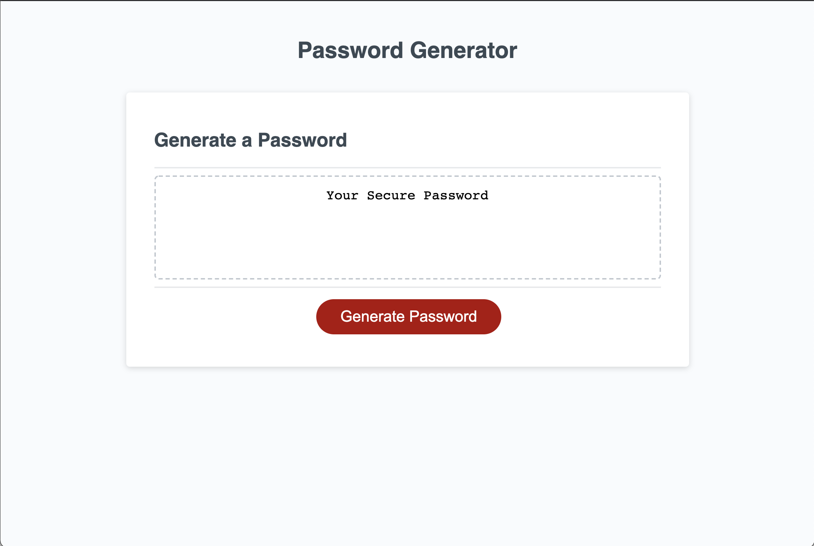

# Password-Generator
An application created with modified code that enables employees to generate random passwords based on criteria that they’ve selected. This app will run in the browser and features dynamically updated HTML and CSS powered by JavaScript code.  It has a  responsive user interface that adapts to multiple screen sizes.

The password can include Uppercase letters, lowercase letters, numbers and special characters.

## This Project Uses:
--------

* Html
* Css
* Javascript

 

#